# 2022-6-13

- 学习了计算机网络第一章的知识，了解了OSI参考模型和TCP/IP参考模型，学习了比特，带宽，延迟的相关知识以及OSI各层的联系以及主要主要协议，对数据传输有了一定的了解。
- 完成了网易云音乐项目的部分界面样式的编写，总结出一些问题。


# 2022-6-14

- 学习了Vue状态管理工具**Pinia**，并在网易云音乐项目中进行了初始化 。

- Pinia相比vuex，少了mutations，并更加方便，且actions同步异步都支持，而vuex中actions只支持异步。

- 使用Pinia的流程：
  - 在vue项目的入口文件中引入createPinia，并挂载于app上
  
  - 创建项目结构中的store文件夹用来存放数据，引入defineStore，第一个参数为ID**（全局唯一）**，第二个参数为一个对象，里面可以包含state、actions、getters；其中state必须是一个函数，而不是vuex中的对象形式，目的是防止数据污染，需要用return返回对象。箭头函数是为了更好的适配TS，使其能够判断类型。actions和getters均为对象形式。
  
  - 组件中引入仓库文件，并调用该函数，赋值给一个常量。
  
    ### state
  
    - 类似于`data`
  
    - 引入，将函数结果给store（可更改）
  
    - 修改和读取值较少时，直接使用`store.xxx`即可。解构仓库中的数据必须使用`storeToRefs`，否则解构出的数据将会失去响应式，因为仓库其实是经过reactive包装的，并且这样解构之后在script中访问必须加上`.value`
  
    - 另一种方法就是`store.$petch()`
  
      1. 传入对象形式，这种方式为多次修改，一次提交。
  
         - 缺点：任何集合修改（例如，从数组中推送、删除、拼接元素）都需要创建一个新集合*[来自官方]*
  
         ```javascript
         store.$patch({
           counter: store.counter + 1,
           name: 'Abalam',
         })
         ```
         
      2. 传入箭头函数**<font color="dd0000">（推荐使用）</font>**
      
         ```javascript
         store.$patch((state) => {
           state.items.push({ name: 'shoes', quantity: 1 })
           state.hasChanged = true
         })
         ```
      
    - 替换某个仓库全部的状态，使用`xxx.$state`
  
      ```js
      store.$state = { counter: 666, name: 'Paimon' }
      ```
      
    - 修改整个项目的仓库，使用`pinia.state.value={}`
  
      ```js
      pinia.state.value = {}
      ```
  
    ### actions
  
    - 类似于`method`
  
    - 可以像方法一样直接在组件中被调用`xxx.xxxx()`
  
    - actions支持异步和同步，在仓库中定义后，使用this可以访问到state
  
    - 若使用其他store的数据，只需内部引用即可
  
      ```js
      actions: {
          method01() {
            // 外部store
            const other = useOtherStore()
          },
      }
      ```
  
    ### getters
  
    - 类似于`computed`，有**缓存**
  
    - 可以传入state，也可以不传，使用this，但在TS中，传入state才可以进行**类型推导**，所以也可以传入state而不去使用它，而是使用this。
  
    - ```js
      getters: {
          doubleCount(state) {
            return state.counter * 2
          },
        },
      ```
  
    - 访问其他
  
      1. 其他getters（同一个store）：使用this访问即可
  
      2. 其他store的getters：要在内部引用
  
         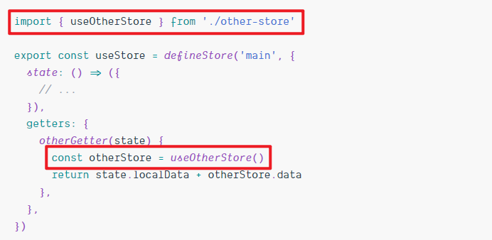 
  
  - 像vuex的modules一样分类存储，只需多创建几个仓库文件，在组件内按需引用即可，若一个仓库用到了另一个仓库的数据，也同样需要引用。


# 2022-6-15

- 今天继续编写网易云音乐的界面，相关问题放在了README文件


# 2022-6-16

- 今天完成网易云音乐所有纯页面
- 学习了CSS的Grid布局
  - 外层元素设置`display:frid;`
  - 独有单位`fr`，代表剩余空间
  - 与flex布局相比，grid更加灵活。flex是一种一维的布局方式，而grid布局则是二维布局
- 了解了CSS BFC，最佳实现是设置 `display:flow-root;  `
  - 可以实现相对于浮动的布局
  - 还可以包裹浮动元素。比如浮动元素超过父元素的高度，为父元素设置BFC后，可以适应浮动元素的高度
  - 也可以消除边距塌陷问题


# 2022-6-17

- 今天学习了前端安全，了解了XSS攻击以及防御方式

# 2022-6-18

- 今天继续做网易云音乐项目，进行前后端交互


# 2022-6-19

- 今天首先学习了HTTP协议，它工作在应用层，是客户端用来获取服务端的资源
  
  - 默认端口为80
  - 客户端向服务端发送请求该请求包含，请求行，请求头，在post请求时也包含请求体
  - 服务端响应，包含响应行，响应头以及响应体
    - 两个都包含空行，以标志请求头/响应头的结束
    - 响应头最重要的是内容类型，因为响应的数据有很多，有了具体类型能够让浏览器更清楚的处理不同的类型
  - 最常用的方法是POST和GET
  - 状态码：2xx表示成功，3xx表示重定向，4xx表示客户端错误，5xx表示服务器错误
  - 绝大部分HTTP协议是基于TCP协议的，进行数据传输
    - TCP协议可靠，有三次握手机制
    - UDP协议不可靠，数据会丢失
  - 持续连接：客户端发送多次请求，在结束之后发送关闭（connection: close）
    - 非持续：一次发一个请求，处理完一个就关闭连接，很难满足需求
  - 无状态：每次请求之间没有任何联系，但是对于需要登录的，没有任何联系就会导致每次都需要登录，因此有了cookie等用户标识技术，在请求头带上一同发给服务端，就不用每次都需要登录了。
  
- 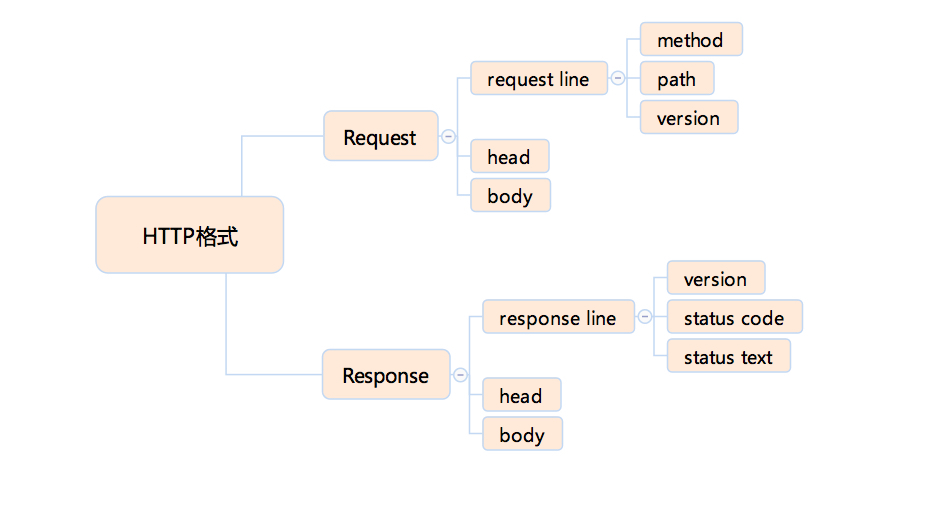 
  
- HTTPS不是一个单独的协议，而是在HTTP基础上进行了加密，现在及未来最常用的是TLS

  - 默认端口变化，HTTP默认端口为80，HTTPS默认端口为443，浏览器会自动补全

  - HTTPS大部分使用非对称加密

  - HTTPS 有两个作用

      - 确定请求的目标服务端身份
  
      - 保证传输的数据不会被网络中间节点窃听或者篡改。
  
  - TLS握手流程：
  
      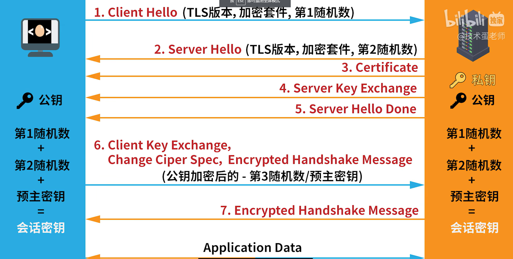 


# 2022-6-20

- 今天继续开发网易云音乐项目
- 学习了骨架屏等提升用户体验的技术
  - 比较看懂的一个【https://juejin.cn/post/7109083708463775752】


# 2022-6-21

- 今天主要阅读了关于优化用户体验的博客
- 学习了计算机网络


# 2022-6-22

- 今天为了使用骨架屏，将路由的hash模式变成了history模式，但是引入index.html后，css样式会引入失败，解决方法是

- 在link标签前面加上`<base href="/" />`

  - 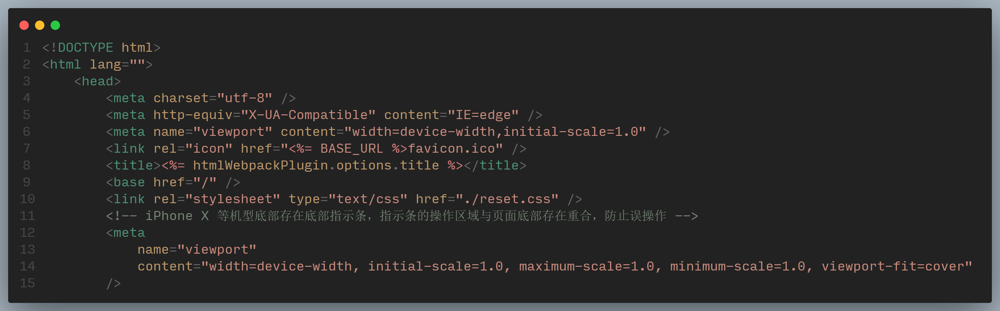
  
  
  


# 2022-6-23

- 今天继续开发网易云音乐项目
- 学习了一些前端监控的一些知识


# 2022-6-24

- 备考


# 2022-6-25

- 今天继续写网易云音乐项目，发现一个关于Tab组件的问题，已提交issue
- 复习css布局常见用法


# 2022-6-26

- 继续做项目


# 2022-6-27

- 备考


# 2022-6-28

- vue在组件某个改变时立刻渲染，比如点击“关注”变为“已关注”
  - 解决方法：
    - 通过key
    - 通过v-if


# 2022-6-29

- 今天继续制作网易云音乐，增加了加载后通过渐变动画实现更好的用户体验


# 2022-6-30

- 学习了性能优化，了解了一些性能指标
- 了解了chrome开发者工具lighthouse的使用
- 学习了计算机网络


# 2022-7-1

- 学习计算机网络
- 学习性能优化在http方面的知识
- 网易云音乐项目


# 2022-7-2

- 回顾CSS动画语法
  - ​	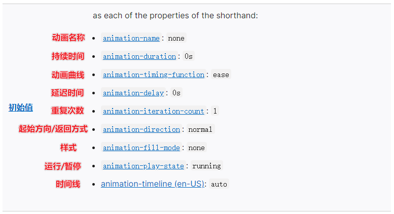 

- 网易云音乐项目


# 2022-7-3

- 学习计算机网络物理层概念以及相关计算
- 网易云音乐项目


# 2022-7-4

- 学习计算机网络，复习物理层相关知识
- 复习CSS过渡和动画，伪类以及伪元素，CSS单位
- 网易云音乐项目


# 2022-7-5

- 网易云音乐项目
- 阅读极客时间专栏重学前端，了解了一些之前未学习的知识
- 学习计算机网络数据链路层的相关知识
- 阅读codepen优秀动画的源码


# 2022-7-6

- 网易云音乐项目
- 阅读极客时间专栏重学前端
- 计算机网络数据链路层


# 2022-7-7

- 今天学习完了《重学前端》中JavaScript中部分，学到了很多以前不知道的知识
  - 脚本，模块，函数体
  - 比如在ES6以前是没有模块的，模块中独有的是import export
  - 只使用export导出时，实际上是引用，只是变量名发生了变化，地址不变，改变之后也会影响其他引用的。而使用export defult 导出时，导出的是default值，改变之后不会影响其他引用该模块的。
- 在 promise 出现之前，javascript 并没有异步，有异步的是宿主环境


# 2022-7-8

- 计算机网络网络层相关知识
- 学习《重学前端》
  - 了解了很多语义化标签
- 复习了JavaScript的事件循环，宏任务和微任务


# 2022-7-9

- 计算机传输层相关知识，TCP UDP协议
- 复习CSS相关知识
  - 特殊规则
    - @keyframes等
  - 一般规则
    - 选择器
    - 内容
  - ······························


# 2022-7-10

- 计算机应用层相关知识


# 2022-7-25

- 网易云音乐项目


# 2022-7-26

- 网易云音乐项目
- 学习canvas基础知识
- 复习http协议

  - 请求头
    - 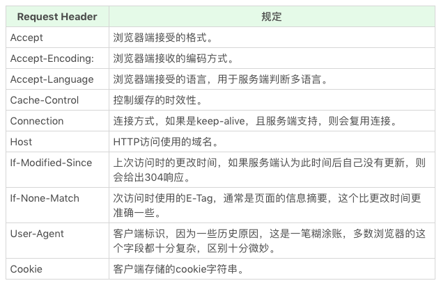 


  - 响应头
    - 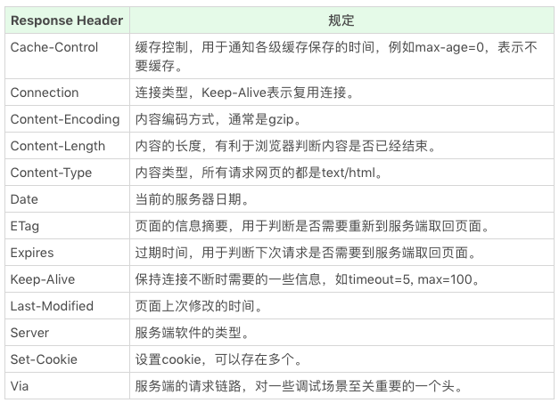 

# 2022-7-27

- 了解了HTML ARIA
  - 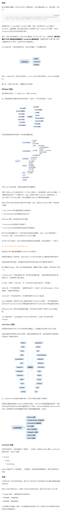 

- 学习了浏览器的工作流程
  - 通过http/https协议从后台获取html
  - 构建dom树，此时cssom也同时生成，是dom树元素逐个匹配cssom，并不是dom树构建完成后再去构建cssom树
  - 构建完成后渲染，形成位图，还有热区等其他复杂东西，并进行合成
  - 绘制：将位图真正的放在屏幕上（交由操作系统处理）
    - 但此时鼠标滑动也会重绘，因此用到了脏矩形算法，只重新绘制受鼠标影响的区域
  - 重绘的频率很高
- 如何降低网页加载时间
  - 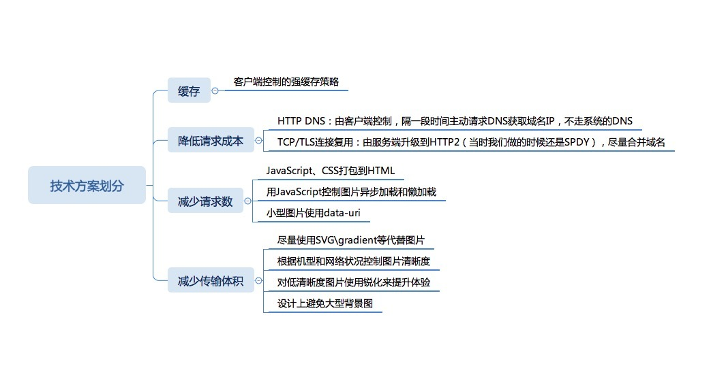 

- 线上监控部分讲解

  - 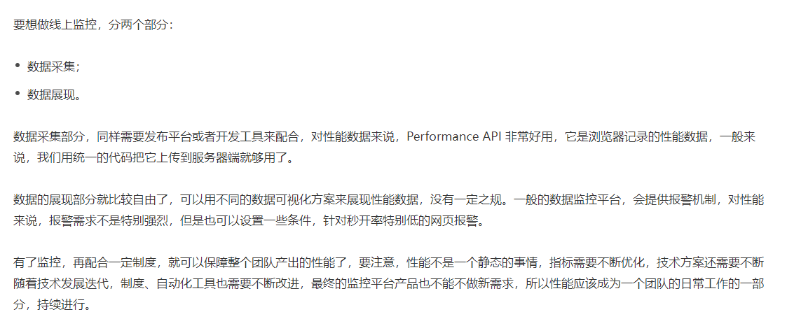 

  - 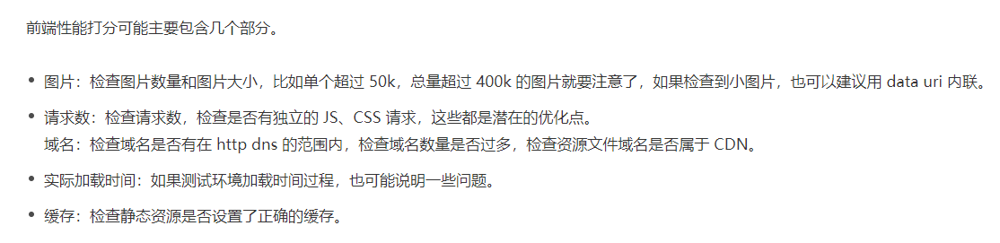 


# 2022-7-28

- Vue-router原理学习

  - hash模式，通过hashChange事件监听变化
    - `window.addEventListener('hashchange',fn)`
    - 在fn回调函数中动态切换页面
    - API：location.hash；Event：hashchange
  - history模式，通过pushState和replaceState监听变化（HTML5后出现）
    - `window.addEventListener('popstate', fn)`
    - 监听 popstate 事件，可以监听到通过 pushState 修改路由的变化。并在 fn 函数中，实现页面的更新操作
    - API：history.pushState，history.replaceState；Event：popstate
    - 优点
      - history更利于SEO
      - history路由与html5的配合更好，能充分利用html5的特性，比如html5中监听滚动条的状态等，history都可以监听
  - 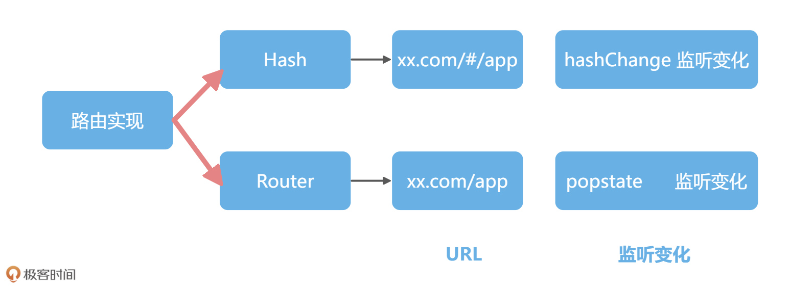 

- 小题目：统计该页面有多少种html标签

  - `new Set([...document.querySelectorAll('*')].map(n=>n.nodeName)).size`

  - 清晰看出

    - ```js
      let ret = Object.entries([...document.querySelectorAll('*')].map(node => node.nodeName).reduce((ret,n)=>{
          ret[n] = ret[n]?ret[n]+1:1
          return ret 
      },{})).sort((a,b)=>b[1]-a[1]).slice(0,3)
      console.table(ret)
      ```

- 用户输入 URL 到页面显示的过程：

  - DNS解析

  - 建立TCP连接

  - 通过http/https协议获取内容

  - 解析HTML

    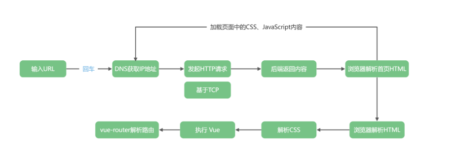 

- Vue项目的性能优化

  - **<font color="red">网络请求优化</font>**

    - 首先就是在首页的标签中，使用标签去通知浏览器对页面中出现的其他域名去做 DNS 的预解析，比如页面中的图片通常都是放置在独立的 CDN 域名下，这样页面加载首页的时候就能预先解析域名并把结果缓存起来

    - > 首先，浏览器在获取网络文件时，需要通过 HTTP 请求，HTTP 协议底层的 TCP 协议每次创建链接的时候，都需要三次握手，而三次握手会造成额外的网络损耗。如果浏览器需要获取的文件较多，那就会因为三次握手次数过多，而带来过多网络损耗的问题；
      >
      > 所以，首先我们需要的是让**文件尽可能地少**，这就诞生出一些常见的优化策略，比如先给文件打包，之后再上线；使用**CSS 雪碧图**来进行图片打包等等；
      >
      > 文件打包这条策略在 HTTP2 全面普及之前还是有效的，但是在 HTTP2 普及之后，多路复用可以**优化三次握手**带来的网络损耗；

    - > 除了让文件尽可能少，我们还可以想办法让这些文件尽可能地小一些；
      >
      > 这一环节也诞生出一些性能优化策略，比如 CSS 和 JavaScript 代码会在上线之前进行压缩；
      >
      > 在图片格式的选择上，对于大部分图片来说，需要使用 JPG 格式，精细度要求高的图片才使用 PNG 格式，优先使用 WebP 等；
      >
      > 也就是说，尽可能在同等像素下，选择体积更小的图片格式；

    - > 在性能优化中，懒加载的方式也被广泛使用；
      >
      > 图片懒加载的意思是，我们可以动态计算图片的位置，只需要正常加载首屏出现的图片，其他暂时没出现的图片只显示一个占位符，等到页面滚动到对应图片位置的时候，再去加载完整图片；
      >
      > 除了图片，项目中也会做路由懒加载，现在项目打包后，所有路由的代码都在首页一起加载。但是，我们也可以把不常用的路由单独打包，在用户访问到这个路由的时候再去加载代码；

  

  - **<font color="red">分析项目文件结构</font>**

    - 通过执行 npm install 操作来安装插件 rollup-plugin-visualizer。使用这个插件后，我们就可以获取到代码文件大小的报告了。之后，进入到 vite.config.js 这个文件中，新增下列代码，就可以在 Vite 中加载可视化分析插件

    - ```js
      import { visualizer } from 'rollup-plugin-visualizer'
      export default defineConfig({
        plugins: [vue(),vueJsx(), visualizer()],
      })
      ```

    - 然后，我们在项目的根目录下执行 npm run build 命令后，项目就把项目代码打包在根目录的 dist 目录下，并且根目录下多了一个文件 stat.html

  

  - **<font color="red">利用缓存</font>**

    - > 返回的文件如何才能高效复用呢？我们需要做的，就是尽可能高效地利用浏览器的缓存机制，在文件内容没有发生变化的时候，做到一次加载多次使用

    - > 浏览器的缓存机制有好几个 Headers 可以实现，Expires、Cache-control，last-modify、etag 这些缓存相关的 Header 可以让浏览器高效地利用文件缓存。
      >
      > 我们需要做的是，只有当文件的内容修改了，我们才会重新加载文件。这也是为什么我们的项目执行 npm run build 命令之后，静态资源都会带上一串 Hash 值，因为这样确保了只有文件内容发生变化的时候，文件名才会发生变化，其他情况都会复用缓存。

  

  - **<font color="red">优化代码</font>**

    - > 在浏览器加载网络请求结束后，页面开始执行 JavaScript，因为 Vue 已经对项目做了很多内部的优化，所以在代码层面，我们需要做的优化并不多。很多 Vue 2 中的性能优化策略，在 Vue 3 时代已经不需要了，我们需要做的就是遵循 Vue 官方的最佳实践，其余的交给 Vue 自身来优化就可以了。

    - > 比如 computed 内置有缓存机制，比使用 watch 函数好一些；
      >
      > 组件里也优先使用 template 去激活 Vue 内置的静态标记，也就是能够对代码执行效率进行优化；
      >
      > v-for 循环渲染一定要有 key，从而能够在虚拟 DOM 计算 Diff 的时候更高效复用标签等等；
      >
      > JavaScript 本身的性能优化，或者说某些实现场景算法的选择了，这里需要具体问题具体分析，在通过性能监测工具发现代码运行的瓶颈后，我们依次对耗时过长的函数进行优化即可；

    - # 性能优化另外一个重要原则 --- 不要过度优化

  

  - **<font color='red'>用户体验优化</font>**

    - **必要的时候，我们可以损失一些性能去换取交互体验的提升**

    - 文件传输

      - > 为了提高用户的体验，我们可以选择断点续传，也就是把文件切分成小块后，挨个上传。这样即使中间上传中断，但下次再上传时，只上传缺失的那些部分就可以了。可以看到，断点上传虽然在性能上，会造成网络请求变多的问题，但也极大地提高了用户上传的体验。

    - 骨架屏

      - > 能够在页面还没有解析完成之前，先渲染一个页面的骨架和 loading 的状态，这样用户在页面加载的等待期就不至于一直白屏
        >
        > 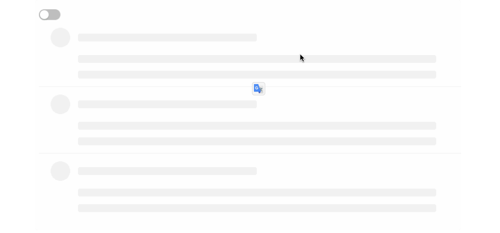 

  

  - **<font color='red'>性能指标</font>**
    - 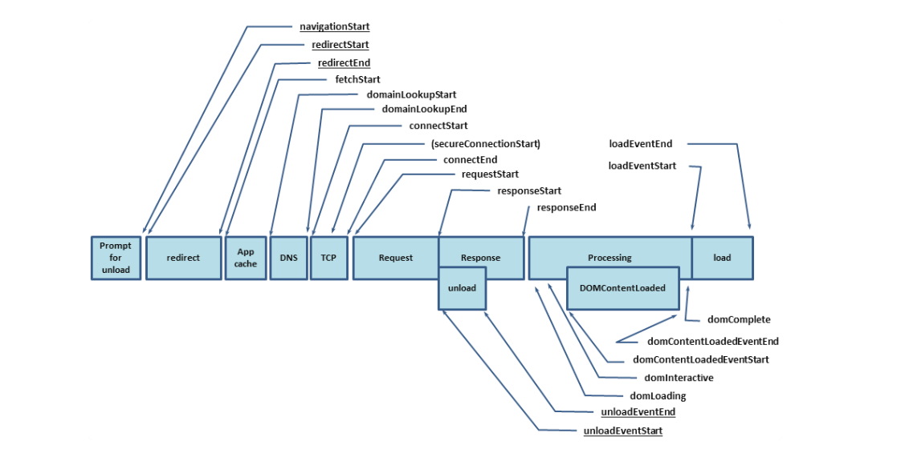
